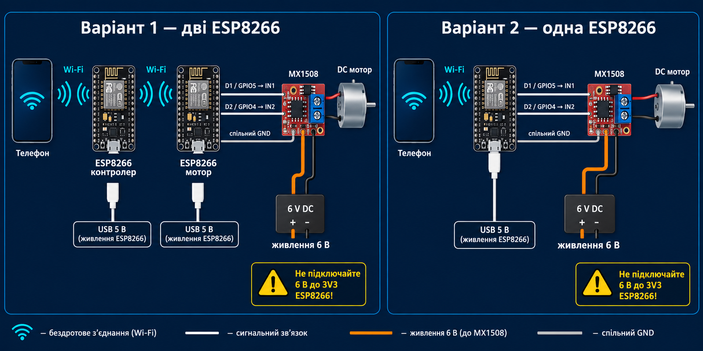

# «Бігунок»: ESP8266 + MX1508 + мотор 6 В

Готовий прототип керування рухом по 4-метровій лінії. У браузері є одна горизонтальна «звукова» шкала: торкніться потрібної координати, і механізм поїде до неї. Центр дорівнює `0 м`, програмна робоча зона за замовчуванням `−1.8…+1.8 м`, а по 20 см біля фізичних кінців залишено як запас.

**Для Arduino IDE:** використовуйте готові окремі скетчі з папки [`ArduinoIDE`](ArduinoIDE/README.md). Перший двоплатний варіант складається з `01_TwoESP_Controller` і `02_TwoESP_Motor`; другий одноплатний варіант — це `03_OneESP`. Команди `pio run` нижче стосуються лише альтернативного середовища PlatformIO.



## Два варіанти

### Чому код лежить в одному проєкті

`src/main.cpp` містить три умовні частини, але PlatformIO компілює з них **три окремі прошивки**:

- середовище `controller` визначає `DEVICE_ROLE_CONTROLLER` і компілює тільки логіку головної ESP;
- середовище `motor` визначає `DEVICE_ROLE_MOTOR` і компілює тільки логіку моторної ESP;
- середовище `single` визначає `DEVICE_ROLE_SINGLE` і компілює сайт та моторний драйвер для однієї ESP.

Тобто у двоплатному варіанті на плати заливаються два різні `firmware.bin`, хоча спільний код зберігається в одному файлі, щоб не дублювати протокол, піни та правила безпеки. Окрема четверта програма `src/calibration.cpp` використовується тільки для вимірювання швидкості.

### 1. Дві ESP8266 — робочий варіант

- `controller`: створює Wi-Fi, віддає сайт, виконує алгоритми та розраховує координату;
- `motor`: підключається до controller напряму через Wi-Fi/WebSocket і керує MX1508;
- усі телефони бачать той самий стан у реальному часі;
- motor негайно вимикається, якщо зв'язок з controller зник більш ніж на 1 секунду.

Для двох вузлів у чистому полі mesh не потрібен. ESP8266-controller є локальною точкою доступу, інтернет і роутер не потрібні. 25–40 м реалістичні лише після польової перевірки конкретних антен, висоти встановлення та рівня завад.

### 2. Одна ESP8266 — стендовий тест

Одна плата одночасно створює сайт і напряму керує MX1508. Інтерфейс та алгоритми ті самі, але немає радіолінії між двома ESP. Це найзручніший варіант для першої перевірки мотора, напрямків і калібрування.

## Підключення MX1508

Для моторної ESP у двоплатному варіанті та єдиної ESP в одноплатному варіанті підключення однакове:

| ESP8266 NodeMCU | MX1508 | Функція |
|---|---|---|
| D1 / GPIO5 | IN1 | PWM / рух вправо |
| D2 / GPIO4 | IN2 | PWM / рух вліво |
| GND | GND | спільна земля |

- два виходи каналу MX1508 → два дроти DC мотора;
- `MX1508 VCC/VM` → `+6 В` окремого джерела;
- мінус джерела 6 В → `MX1508 GND` і `ESP8266 GND`;
- ESP8266 → окреме стабільне USB-живлення 5 В;
- рекомендовано 470–1000 µF біля живлення MX1508 і 100 nF на клемах мотора.

**Не подавайте 6 В на 3V3 ESP8266 і не живіть мотор від плати ESP8266.** Джерело та драйвер мають витримувати пусковий/заблокований струм вашого мотора. Перед механічним тестом бажано встановити фізичний аварійний вимикач у ланцюг 6 В.

## Вебінтерфейс

Після підключення телефона до Wi-Fi `Motor-Control` (пароль `motor8266`) відкрийте:

- `http://motor.local` — зручна постійна адреса;
- `http://192.168.4.1` — гарантований запасний варіант.

Також controller запускає captive DNS: на багатьох телефонах сторінка запропонується автоматично після підключення до Wi-Fi. `.local` залежить від підтримки mDNS операційною системою, тому IP-адресу варто зберегти як закладку.

Білий кружок показує розрахункову поточну координату, синя мітка — ціль. Перетягування шкали одразу змінює ціль. Велика червона кнопка зупиняє ручний рух і будь-яку програму.

## Чотири програми

1. **Маятник** — повторює `−1.70 → +1.70 м` зі спокійною швидкістю.
2. **Драбинка** — поступово збільшує амплітуду: `±0.45 → ±0.90 → ±1.35 → ±1.70 м`.
3. **Ривки** — нерівна послідовність `−1.60 → +0.80 → +1.60 → −0.80 → 0 м` на вищій швидкості.
4. **Хаос** — випадкова координата в робочій зоні, випадкова швидкість 35–85% і випадкова коротка пауза.

Алгоритми не використовують `delay()`, тому сайт, WebSocket і аварійний STOP залишаються активними під час руху.

## Прошивання

Проєкт розрахований на PlatformIO і NodeMCU ESP-12E/ESP-12F. Якщо плата інша, замініть `board = nodemcuv2` у `platformio.ini`.

### Варіант з двома ESP8266

Під'єднайте головну ESP і виконайте:

```powershell
pio run -e controller -t upload
```

Потім під'єднайте моторну ESP:

```powershell
pio run -e motor -t upload
```

### Варіант з однією ESP8266

```powershell
pio run -e single -t upload
```

Збірка всіх чотирьох конфігурацій без прошивання:

```powershell
pio run
```

## Окрема прошивка калібрування

Для калібрування під'єднайте ESP8266 безпосередньо до MX1508, як у варіанті з однією платою, і прошийте:

```powershell
pio run -e calibration -t upload
```

Після перезапуску:

1. підключіться до Wi-Fi `Motor-Calibration`, пароль `motor8266`;
2. відкрийте `http://motor.local` або `http://192.168.4.1`;
3. виберіть напрямок, PWM і час тесту;
4. натисніть «Запустити тест» — мотор відпрацює точний час і зупиниться;
5. рулеткою виміряйте фактичний шлях та введіть сантиметри;
6. сторінка покаже метри за секунду і сантиметри за одну секунду;
7. виконайте правий і лівий тест на однаковому PWM — сторінка сформує готовий рядок `{PWM, вправо, вліво}` для `SPEED_CALIBRATION`.

Файл цієї самостійної програми: `src/calibration.cpp`. Для пошуку максимальної швидкості виберіть `100%`. Надійніше зробити три повтори в кожен бік та використати середнє значення. Під час тесту сторінка залишається активною, а кнопка STOP зупиняє двигун негайно.

## Ручне виставлення центру

1. Відкрийте блок «Ручне виставлення і калібрування».
2. Утримуйте «вліво» або «вправо», доки механізм фізично не стане в центр.
3. Відпустіть кнопку.
4. Натисніть «Позначити поточне місце як центр».

Ручний рух має dead-man захист: браузер повторює команду, а без повтору протягом 650 мс мотор зупиняється.

## Калібрування швидкості в коді

Без енкодера координата оцінюється за формулою `відстань = час × швидкість`. Початкові цифри в `include/config.h` є лише прикладом. Для кожного PWM треба виміряти швидкість окремо вправо і вліво:

1. позначте тестову ділянку, наприклад 1 м;
2. виставте механізм у початок і позначте цю позицію як центр;
3. виберіть PWM, наприклад 40%, та заміряйте час проходження 1 м;
4. обчисліть `м/с = 1 м / виміряний час у секундах`;
5. повторіть вправо, вліво і для 25, 40, 55, 70, 85, 100%;
6. внесіть значення в `SPEED_CALIBRATION`:

```cpp
constexpr CalibrationPoint SPEED_CALIBRATION[] = {
  // PWM, вправо м/с, вліво м/с
  {25, 0.16f, 0.15f},
  {40, 0.28f, 0.27f},
  {55, 0.42f, 0.40f},
  {70, 0.58f, 0.55f},
  {85, 0.73f, 0.69f},
  {100, 0.88f, 0.83f},
};
```

Між точками використовується лінійна інтерполяція. Змінити довжину можна через `TRACK_LENGTH_M`, а запас біля країв — через `SAFE_MARGIN_M`.

## Головне обмеження прототипу

Цей варіант — **розімкнене керування**: реальної позиції система не вимірює. Прослизання, зміна напруги акумулятора, навантаження та інерція створюють накопичувану похибку. Перед кожною сесією треба фізично виставляти центр. Для надійної експлуатації наступний крок — додати енкодер на колесо/вал і два кінцевики; тоді слайдер керуватиме реальною, а не розрахунковою координатою.
